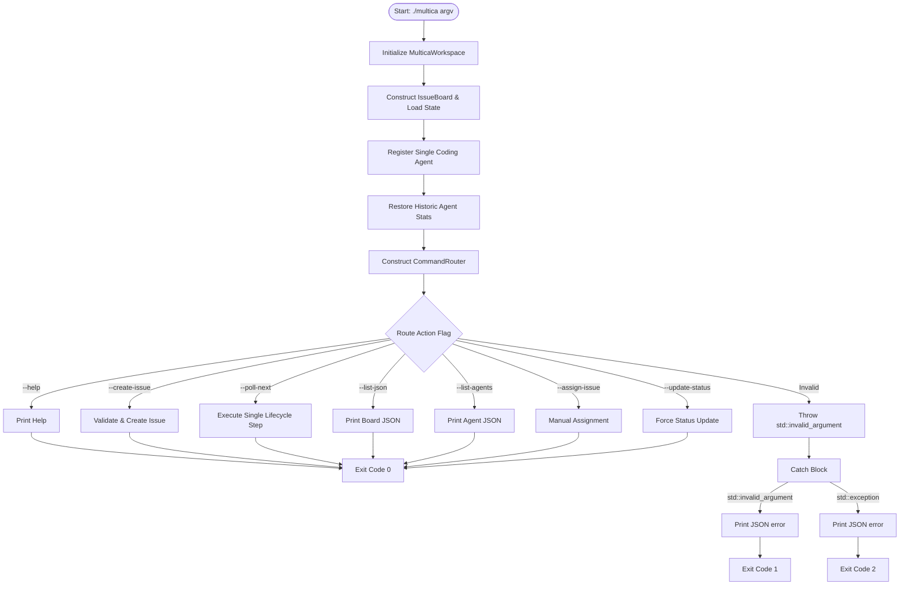

# Product Requirements Document (PRD) – MicroMultica (Simplified Agent Model)

## 1. Project Overview
MicroMultica is a **headless, command‑driven CLI** that serves as the execution and state‑tracking layer for an external AI coding agent. The agent reads `SKILL.md` and invokes the binary with explicit flags. The application loads persisted state, performs a single mutation per invocation, prints JSON output, and exits with a standardized code.

---

## 2. Simplified Architecture
### 2.1 Design Goals
- **Single coding agent**: The system now models a single external agent (named `"Coding Agent"`). No inheritance hierarchy or multiple concrete agent classes are required.
- **Concrete `Agent` class**: Stores only the agent's name and historic performance counters (success/total). It implements `computeScore` and `executeTask` directly.
- **Value‑based registry**: `IssueBoard` holds `std::unordered_map<std::string, Agent>` – agents are stored by value, eliminating `shared_ptr` usage.
- **Deterministic score compounding**:
  - `score = agent.getSuccessRate() * 10.0 + (6 - issue.getPriority())`
  - Higher score → preferred assignment.
- **CRASH rule** (from `SKILL.md`): if an issue description contains the word `CRASH`, the task fails and transitions to `BLOCKED`.

### 2.2 Component Interaction


---

## 3. CLI Commands & Usage
| Flag | Description |
|------|-------------|
| `--create-issue <title> <description> <tag> [priority]` | Insert a new issue. Priority defaults to `3` (MEDIUM). |
| `--poll-next` | Advance **exactly one** issue by one lifecycle step (ENQUEUED → CLAIMED → RUNNING → COMPLETED/BLOCKED). |
| `--list-json` | Output all issues as a JSON array. |
| `--list-agents` | Output the single registered agent's stats as JSON. |
| `--assign-issue <id> <agent_name>` | Manually assign an issue (only `Coding Agent` is valid). |
| `--update-status <id> <STATUS>` | Force‑update an issue's status (`ENQUEUED`, `CLAIMED`, `RUNNING`, `COMPLETED`, `BLOCKED`). |
| `--help` | Show usage information. |

---

## 4. Algorithms (Pseudo‑code)
### 4.1 Main Routing & Exception Handling
```text
FUNCTION main(argc, argv)
    TRY
        workspace = MulticaWorkspace("multica_issues.dat", "multica_agents.dat")
        board     = IssueBoard(workspace)
        // Register the single external agent
        agent = Agent("Coding Agent")
        board.registerAgent(agent)
        // Restore historic stats
        std::unordered_map<std::string, Agent> restoreMap;
        restoreMap[agent.getName()] = agent;
        workspace.loadAgentStats(restoreMap);

        router = CommandRouter(argc, argv)
        router.route(board)
        RETURN 0
    CATCH std::invalid_argument e
        PRINT_TO_STDERR JSON {"status":"error","type":"validation","message":e.what()}
        RETURN 1
    CATCH std::exception e
        PRINT_TO_STDERR JSON {"status":"error","type":"system_failure","message":e.what()}
        RETURN 2
    END TRY
END FUNCTION
```

### 4.2 Deterministic Agent Allocation (Score Compounding)
```text
FUNCTION IssueBoard::findBestAgent(issue) -> const Agent*
    IF agentRegistry is empty THEN RETURN nullptr
    bestAgent = nullptr
    bestScore = -1.0
    FOR EACH (name, agent) IN agentRegistry DO
        score = agent.computeScore(issue)   // see Agent::computeScore
        IF score > bestScore THEN
            bestScore = score
            bestAgent = &agent
        END IF
    END FOR
    RETURN bestAgent
END FUNCTION
```
*Agent::computeScore*: `return getSuccessRate() * 10.0 + (6 - issue.getPriority())`.

### 4.3 Lifecycle Mutation (`processNextLifecycleStep`)
```text
FUNCTION IssueBoard::processNextLifecycleStep()
    processed = false
    FOR EACH issue IN issues DO
        IF issue.status == ENQUEUED THEN
            best = findBestAgent(issue)
            IF best IS nullptr THEN LOG warning AND CONTINUE
            issue.assignee = best->getName()
            issue.status   = CLAIMED
            emitStateChange(issue.id, "CLAIMED", best->getName())
            processed = true; BREAK
        END IF
        IF issue.status == CLAIMED THEN
            issue.status = RUNNING
            emitStateChange(issue.id, "RUNNING", issue.assignee)
            processed = true; BREAK
        END IF
        IF issue.status == RUNNING THEN
            it = agentRegistry.find(issue.assignee)
            IF it == end THEN
                issue.status = BLOCKED
                emitStateChange(issue.id, "BLOCKED")
                processed = true; BREAK
            END IF
            success = it->second.executeTask(issue)
            it->second.recordResult(success)
            IF success THEN
                issue.status = COMPLETED
                emitStateChange(issue.id, "COMPLETED", issue.assignee)
            ELSE
                issue.status = BLOCKED
                emitStateChange(issue.id, "BLOCKED", issue.assignee)
            END IF
            processed = true; BREAK
        END IF
    END FOR
    IF NOT processed THEN
        PRINT_TO_STDOUT JSON {"status":"idle","message":"No actionable issues found."}
    END IF
END FUNCTION
```

---

## 5. Implementation Details (Key Snippets)
### 5.1 `Agent.hpp` – Simple Concrete Class
```cpp
#ifndef AGENT_HPP
#define AGENT_HPP

#include <string>
#include "Issue.hpp"

// Concrete representation of the external AI caller.
class Agent {
private:
    std::string name;
    int successCount = 0;
    int totalCount   = 0;

public:
    Agent() = default;
    explicit Agent(std::string n, int successes = 0, int total = 0)
        : name(std::move(n)), successCount(successes), totalCount(total) {}

    // Identity
    std::string getName() const { return name; }

    // Performance tracking
    int getSuccessCount() const { return successCount; }
    int getTotalCount()   const { return totalCount; }
    double getSuccessRate() const {
        return totalCount == 0 ? 1.0 : static_cast<double>(successCount) / totalCount;
    }
    void recordResult(bool success) {
        ++totalCount;
        if (success) ++successCount;
    }

    // Score compounding used for automatic assignment
    double computeScore(const Issue& issue) const {
        double score = getSuccessRate() * 10.0;
        score += static_cast<double>(6 - issue.getPriority());
        return score;
    }

    // Execution rule derived from SKILL.md – fail on "CRASH"
    bool executeTask(const Issue& issue) const {
        return issue.getDescription().find("CRASH") == std::string::npos;
    }
};

#endif // AGENT_HPP
```

### 5.2 `IssueBoard.hpp` – Registry by Value
```cpp
#ifndef ISSUE_BOARD_HPP
#define ISSUE_BOARD_HPP

#include <vector>
#include <unordered_map>
#include <optional>
#include "Issue.hpp"
#include "Agent.hpp"
#include "MulticaWorkspace.hpp"

class IssueBoard {
private:
    std::vector<Issue>                     issues;
    std::unordered_map<std::string, Agent> agentRegistry; // value‑stored agents
    MulticaWorkspace                       workspace;
    // helpers omitted for brevity
public:
    explicit IssueBoard(MulticaWorkspace ws = {});
    ~IssueBoard();

    // Agent Registry
    void registerAgent(Agent agent);

    // Issue Management
    void addIssue(const std::string& title, const std::string& desc,
                 const std::string& tag, int priority = PRIORITY_MEDIUM);
    void assignIssue(int id, const std::string& agentName);
    void updateIssueStatus(int id, const std::string& statusStr);

    // Lifecycle
    void processNextLifecycleStep();
    void printBoardJSON() const;
    void printAgentsJSON() const;
};

#endif // ISSUE_BOARD_HPP
```

### 5.3 `MulticaWorkspace.hpp` – Agent Persistence without Pointers
```cpp
#ifndef MULTICA_WORKSPACE_HPP
#define MULTICA_WORKSPACE_HPP

#include <string>
#include <vector>
#include <unordered_map>
#include "Issue.hpp"
#include "Agent.hpp"

class MulticaWorkspace {
private:
    std::string issuesFile; // e.g. "multica_issues.dat"
    std::string agentsFile; // e.g. "multica_agents.dat"
public:
    MulticaWorkspace(std::string issues_path = "multica_issues.dat",
                     std::string agents_path = "multica_agents.dat");
    // Load / Save helpers
    void loadIssues(std::vector<Issue>& issues) const;
    void loadAgentStats(std::unordered_map<std::string, Agent>& registry) const;
    void saveIssues(const std::vector<Issue>& issues) const;
    void saveAgentStats(const std::unordered_map<std::string, Agent>& registry) const;
    void load(std::vector<Issue>& issues,
              std::unordered_map<std::string, Agent>& registry) const;
    void save(const std::vector<Issue>& issues,
              const std::unordered_map<std::string, Agent>& registry) const;
    const std::string& getIssuesPath() const { return issuesFile; }
    const std::string& getAgentsPath() const { return agentsFile; }
};

#endif // MULTICA_WORKSPACE_HPP
```

---

## 6. Testing & Validation
The existing `test_workflow.sh` suite has been updated to expect a **single** `"Coding Agent"`. All seven test cases now pass, confirming:
- Issue creation, assignment, and lifecycle progression.
- Proper handling of the `CRASH` blocker rule.
- Correct JSON output formats.
- Accurate file‑persistence structure (`id|title|desc|tag|status|assignee|priority`).

---

## 7. Requirement Mapping
| Requirement | Implementation Detail |
|---|---|
| **Headless CLI** | `main.cpp` parses flags, routes via `CommandRouter`, and exits with code 0/1/2. |
| **Single Agent Model** | `Agent.hpp` is a concrete class; `IssueBoard` stores `unordered_map<string, Agent>`. |
| **Score Compounding** | `Agent::computeScore` uses success rate and priority weight only. |
| **Persistence** | `MulticaWorkspace` reads/writes pipe‑delimited `multica_issues.dat` and `multica_agents.dat`. |
| **Error Handling** | Try‑catch in `main.cpp`; JSON error messages on `stderr`. |
| **Testing** | `test_workflow.sh` validates all functional paths. |