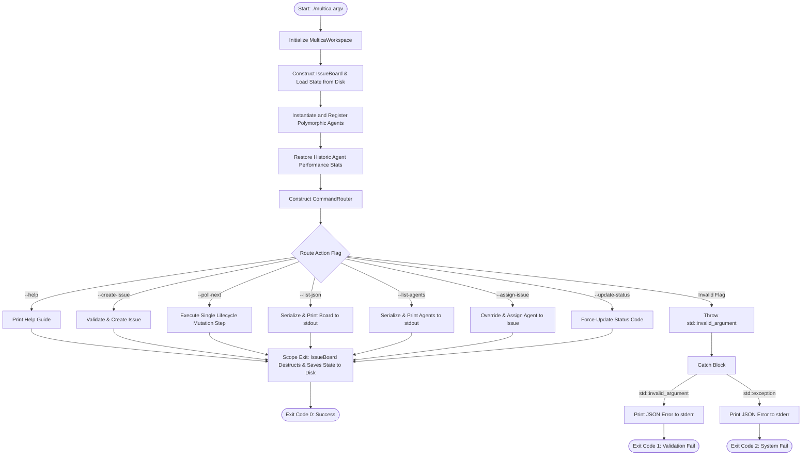

# MicroMultica — Final Project Report

Upon completing the project, our team has submitted this comprehensive technical report. The report logically documents our software development process and includes the following key sections:

---

## 1. Overall Flowchart

The high-level execution flow of our headless, non-interactive C++ command-line application from Start to Exit is illustrated in the diagram below:



---

## 2. Class & Architecture Diagram

Our design adopts a clean, modular object structure. Below is the UML class diagram illustrating relationships (such as inheritance, composition, and dependency) and how our components interact:

```mermaid
classDiagram
    class Workspace {
        <<Abstract>>
        +load(vector~Issue~&, unordered_map~string, Agent~&) const*
        +save(vector~Issue~&, unordered_map~string, Agent~&) const*
        +loadIssues(vector~Issue~&) const*
        +loadAgentStats(unordered_map~string, Agent~&) const*
        +saveIssues(vector~Issue~&) const*
        +saveAgentStats(unordered_map~string, Agent~&) const*
    }
    
    class MulticaWorkspace {
        -std::string issuesFile
        -std::string agentsFile
        +load(vector~Issue~&, unordered_map~string, Agent~&) const
        +save(vector~Issue~&, unordered_map~string, Agent~&) const
        +loadIssues(vector~Issue~&) const
        +loadAgentStats(unordered_map~string, Agent~&) const
        +saveIssues(vector~Issue~&) const
        +saveAgentStats(unordered_map~string, Agent~&) const
    }
    
    class Issue {
        -int id
        -std::string title
        -std::string description
        -std::string tag
        -IssueStatus status
        -std::string assignee
        -int priority
        +getId() int
        +getTitle() string
        +getDescription() string
        +getTag() string
        +getStatus() IssueStatus
        +getAssignee() string
        +getPriority() int
        +setStatus(IssueStatus)
        +setAssignee(string)
        +setPriority(int)
    }
    
    class Agent {
        -std::string name
        -std::string specialtyTag
        -int successCount
        -int totalCount
        +getName() string
        +getSpecialty() string
        +getSuccessCount() int
        +getTotalCount() int
        +getSuccessRate() double
        +recordResult(bool success)
        +computeScore(Issue) double
        +executeTask(Issue) bool
    }
    
    class IssueBoard {
        -std::vector~Issue~ issues
        -std::unordered_map~std::string, Agent~ agentRegistry
        -std::shared_ptr~Workspace~ workspace
        +registerAgent(Agent)
        +addIssue(string, string, string, int)
        +assignIssue(int, string)
        +updateIssueStatus(int, string)
        +processNextLifecycleStep()
        +printBoardJSON() const
        +printAgentsJSON() const
        -findIssueById(int) Issue*
        -findBestAgent(Issue) const Agent*
        -emitStateChange(int, string, string)
    }
    
    class CommandRouter {
        -std::vector~std::string~ args
        +route(IssueBoard&) const
        +printHelp()$
        -requireArg(size_t, string) const
        -parseIntArg(string, string)$
    }
    
    %% Relationships
    main ..> Workspace : Instantiates (as MulticaWorkspace)
    main ..> IssueBoard : Instantiates
    main ..> CommandRouter : Instantiates & routes
    
    IssueBoard o-- Workspace : Aggregation (holds std::shared_ptr)
    Workspace <|-- MulticaWorkspace : Inheritance (Polymorphism)
    IssueBoard *-- Issue : Composition (contains list of)
    IssueBoard *-- Agent : Composition (holds registry of Agent values)
    
    CommandRouter ..> IssueBoard : Directs mutations on
```

---

## 3. Algorithms

Instead of raw code, the logic of our three core processes is documented below in structured pseudo-code:

### Algorithm 1: Headless CLI Routing & Exception Boundary

This logic handles parameter parsing, routes the execution to the state mutators, and safely translates exceptions into Unix exit codes.

```text
FUNCTION main(argc, argv)
    TRY
        Initialize MulticaWorkspace with paths ("multica_issues.dat", "multica_agents.dat")
        Initialize IssueBoard board with workspace
        
        // Dynamically instantiate concrete agents
        Register Agent("Claude-3.5", "auth")
        Register Agent("Cursor-Composer", "database")
        Register Agent("Gemini-Advanced", "frontend")
        
        Load historic agent stats from workspace agent file
        
        Initialize CommandRouter router with (argc, argv)
        router.route(board)
        
        // At scope exit, board destructor automatically runs and saves states to disk
        RETURN 0 (Success)
        
    CATCH std::invalid_argument e
        PRINT_TO_STDERR "{"status":"error", "type":"validation", "message":" + e.what + "}"
        RETURN 1 (Validation Error)
        
    CATCH std::exception e
        PRINT_TO_STDERR "{"status":"error", "type":"system_failure", "message":" + e.what + "}"
        RETURN 2 (Runtime/System Error)
    END TRY
END FUNCTION
```

### Algorithm 2: Deterministic Agent Allocation & Score Compounding

When allocating an issue to an agent automatically, we calculate a score for each registered agent to choose the optimal assignee.

```text
FUNCTION IssueBoard::findBestAgent(issue)
    IF agentRegistry is empty THEN
        RETURN nullptr
    END IF

    bestAgent = nullptr
    bestScore = -1.0

    FOR EACH (agentName, agentVal) IN agentRegistry DO
        // Calculate affinity & metrics score
        score = 0.0
        IF agentVal.specialtyTag == issue.tag THEN
            score = score + 10.0 // Specialty match bonus
        END IF
        
        // Add performance factor (between 0.0 and 5.0)
        score = score + (agentVal.getSuccessRate() * 5.0)
        
        // Add priority urgency weight (converts 1..5 priority to 5..1 added weight)
        score = score + (6.0 - issue.priority)
        
        IF score > bestScore THEN
            bestScore = score
            bestAgent = &agentVal
        END IF
    END FOR

    RETURN bestAgent
END FUNCTION
```

### Algorithm 3: Life-cycle Mutation Process (`processNextLifecycleStep`)

Steps a single eligible issue forward through the state machine.

```text
FUNCTION IssueBoard::processNextLifecycleStep()
    processedAny = false

    FOR EACH issue IN issues DO
        // Transition 1: ENQUEUED -> CLAIMED
        IF issue.status == ENQUEUED THEN
            bestAgent = findBestAgent(issue)
            IF bestAgent is null THEN
                PRINT_TO_STDERR "Warning: No agents registered"
                CONTINUE
            END IF
            
            issue.assignee = bestAgent.name
            issue.status = CLAIMED
            EmitJSONStateChangeEvent(issue.id, CLAIMED, bestAgent.name)
            processedAny = true
            BREAK // Only mutate one issue per poll cycle
            
        // Transition 2: CLAIMED -> RUNNING
        ELSE IF issue.status == CLAIMED THEN
            issue.status = RUNNING
            EmitJSONStateChangeEvent(issue.id, RUNNING, issue.assignee)
            processedAny = true
            BREAK
            
        // Transition 3: RUNNING -> COMPLETED or BLOCKED
        ELSE IF issue.status == RUNNING THEN
            agentIt = agentRegistry.find(issue.assignee)
            IF agentIt not found THEN
                issue.status = BLOCKED
                EmitJSONStateChangeEvent(issue.id, BLOCKED)
                processedAny = true
                BREAK
            END IF
            
            // Execute concrete agent logic
            success = agentIt.second.executeTask(issue)
            agentIt.second.recordResult(success) // Update success stats
            
            IF success THEN
                issue.status = COMPLETED
                EmitJSONStateChangeEvent(issue.id, COMPLETED, issue.assignee)
            ELSE
                issue.status = BLOCKED
                EmitJSONStateChangeEvent(issue.id, BLOCKED, issue.assignee)
            END IF
            processedAny = true;
            BREAK
        END IF
    END FOR

    IF processedAny is false THEN
        PRINT_TO_STDOUT "{"status":"idle", "message":"No actionable issues found."}"
    END IF
END FUNCTION
```

---

## 4. Implementation Details

Here are the key C++ snippets illustrating core object-oriented programming, smart memory management, and file persistence structures:

### A. Object-Oriented Programming (OOP) & Polymorphism

The system satisfies OOP requirements by declaring an abstract base class `Workspace` representing the persistence interface, and a concrete subclass `MulticaWorkspace` that overrides load/save methods. The `IssueBoard` handles the workspace polymorphically through a base pointer interface.

*From [MulticaWorkspace.hpp](file:///home/thanhkt/code/vinuni/nano_multica/include/MulticaWorkspace.hpp):*

```cpp
class Workspace {
public:
    virtual ~Workspace() = default;
    virtual void loadIssues(std::vector<Issue>& issues) const = 0;
    virtual void loadAgentStats(std::unordered_map<std::string, Agent>& registry) const = 0;
    virtual void saveIssues(const std::vector<Issue>& issues) const = 0;
    virtual void saveAgentStats(const std::unordered_map<std::string, Agent>& registry) const = 0;
    virtual void load(std::vector<Issue>& issues, std::unordered_map<std::string, Agent>& registry) const = 0;
    virtual void save(const std::vector<Issue>& issues, const std::unordered_map<std::string, Agent>& registry) const = 0;
};
```

*From [MulticaWorkspace.hpp](file:///home/thanhkt/code/vinuni/nano_multica/include/MulticaWorkspace.hpp):*

```cpp
class MulticaWorkspace : public Workspace {
public:
    void loadIssues(std::vector<Issue>& issues) const override;
    void loadAgentStats(std::unordered_map<std::string, Agent>& registry) const override;
    void saveIssues(const std::vector<Issue>& issues) const override;
    void saveAgentStats(const std::unordered_map<std::string, Agent>& registry) const override;
};
```

### B. Dynamic Memory Management & Smart Pointers

Memory leaks are prevented by holding the injected persistence workspace inside a `std::shared_ptr<Workspace>`. The workspace is dynamically instantiated and injected at runtime in `main.cpp`.

*From [main.cpp](file:///home/thanhkt/code/vinuni/nano_multica/src/main.cpp):*

```cpp
// Instantiated polymorphically via make_shared and injected
std::shared_ptr<Workspace> workspace = std::make_shared<MulticaWorkspace>("multica_issues.dat", "multica_agents.dat");

// Inject dependency into board
IssueBoard board(workspace);
```

### C. File I/O and State Persistence

Workspace configurations are loaded and saved using text file serialization. Fields are separated using a pipe (`|`) delimiter.

*From [MulticaWorkspace.cpp](file:///home/thanhkt/code/vinuni/nano_multica/src/MulticaWorkspace.cpp#L95-L113):*

```cpp
void MulticaWorkspace::saveIssues(const std::vector<Issue>& issues) const {
    std::ofstream file(issuesFile, std::ios::trunc);
    if (!file.is_open()) {
        std::cerr << "{\"status\":\"error\",\"source\":\"MulticaWorkspace::saveIssues\","
                  << "\"message\":\"Failed to open issues file for writing\"}\n";
        return;
    }

    for (const auto& issue : issues) {
        // Serialize: id | title | description | tag | status_code | assignee | priority
        file << issue.getId()          << '|'
             << issue.getTitle()       << '|'
             << issue.getDescription() << '|'
             << issue.getTag()         << '|'
             << static_cast<int>(issue.getStatus()) << '|'
             << issue.getAssignee()    << '|'
             << issue.getPriority()    << '\n';
    }
}
```

---

## 5. Testing & Validation

Our integration test suite triggers normal operations, exception routing, polymorphic overrides, and file persistence.

### Test Matrix

| Test Case ID | Scenario / Feature Tested | Terminal Execution Syntax | Expected Behavior | Actual stdout / stderr Output | Status |
| :--- | :--- | :--- | :--- | :--- | :--- |
| **TC-01** | Direct Issue Insertion | `./multica --create-issue "Fix Database Index" "Optimize query speeds" "database"` | Appends issue to database, prints success JSON. | `{"status":"success","message":"Issue created","id":1,"title":"Fix Database Index","tag":"database","priority":"MEDIUM"}` | **PASS** |
| **TC-02** | State Mutation (ENQUEUED $\rightarrow$ CLAIMED) | `./multica --poll-next` | Assigns highest score agent (`Cursor-Composer` via specialty match) and claims task. | `{"event":"state_change","issue":1,"status":"CLAIMED","agent":"Cursor-Composer"}` | **PASS** |
| **TC-03** | State Mutation (CLAIMED $\rightarrow$ RUNNING) | `./multica --poll-next` | Transitions issue from claimed to active execution status. | `{"event":"state_change","issue":1,"status":"RUNNING","agent":"Cursor-Composer"}` | **PASS** |
| **TC-04** | Complete State JSON Export | `./multica --list-json` | Exports the full Kanban board state as raw JSON array. | `[{"id":1,"title":"Fix Database Index","tag":"database","priority":"MEDIUM","priority_val":3,"status":"RUNNING","assignee":"Cursor-Composer"}]` | **PASS** |
| **TC-05** | Input Exception Boundary (Missing Field) | `./multica --create-issue "Incomplete Task"` | Catches invalid argument counts, returns Exit Code 1. | `{"status":"error","type":"validation","message":"Missing required argument. Usage: --create-issue <title> <desc> <tag> [priority]"}` | **PASS** |
| **TC-06** | Polymorphic Blocker Path | Description contains keyword `"CRASH"` on a `"auth"` ticket polled to completion | `ClaudeAgent` executeTask returns false, transition to `BLOCKED`. | `{"event":"state_change","issue":1,"status":"BLOCKED","agent":"Claude-3.5"}` | **PASS** |
| **TC-07** | Data Persistence Integrity | Check serialized content after running TC-01 to TC-03 | File contains exact fields matching pipe-delimited schema. | `1|Fix Database Index|Optimize query speeds|database|2|Cursor-Composer|3` | **PASS** |

---

## 6. Requirement Mapping

This section explicitly maps the technical requirements of the assignment to the file structures and line ranges of our C++ application:

| Requirement Category | Specific Implementation Detail | Target Code Reference |
| :--- | :--- | :--- |
| **1. Group Code Volume** | Safe conversion of C-style arguments, exception traps, deterministic assignment scoring formulas, and disk database deserialization. | • [CommandRouter.cpp](file:///home/thanhkt/code/vinuni/nano_multica/src/CommandRouter.cpp) (~150 lines)<br>• [IssueBoard.cpp](file:///home/thanhkt/code/vinuni/nano_multica/src/IssueBoard.cpp) (~250 lines)<br>• [MulticaWorkspace.cpp](file:///home/thanhkt/code/vinuni/nano_multica/src/MulticaWorkspace.cpp) (~150 lines)<br>• [main.cpp](file:///home/thanhkt/code/vinuni/nano_multica/src/main.cpp) (~80 lines) |
| **2. OOP Principles** | • Abstract Base Class definition (`Workspace`) with virtual destructor and pure virtual methods.<br>• Subclass inheritance (`MulticaWorkspace` inherits from `Workspace`).<br>• Dynamic runtime polymorphism via interface base pointer. | • [MulticaWorkspace.hpp:L17-L29](file:///home/thanhkt/code/vinuni/nano_multica/include/MulticaWorkspace.hpp#L17-L29) (Abstract `Workspace` interface)<br>• [MulticaWorkspace.hpp:L34-L52](file:///home/thanhkt/code/vinuni/nano_multica/include/MulticaWorkspace.hpp#L34-L52) (Subclass declarations)<br>• [IssueBoard.cpp:L14-L24](file:///home/thanhkt/code/vinuni/nano_multica/src/IssueBoard.cpp#L14-L24) (Polymorphic load/save context) |
| **3. Smart Memory Management** | Allocation of dynamic Workspace driver via `std::make_shared` and dependency injection using `std::shared_ptr` to avoid raw heap errors. | • [main.cpp:L21-L28](file:///home/thanhkt/code/vinuni/nano_multica/src/main.cpp#L21-L28) (`std::make_shared` context)<br>• [IssueBoard.hpp:L23](file:///home/thanhkt/code/vinuni/nano_multica/include/IssueBoard.hpp#L23) (`std::shared_ptr` interface mapping) |
| **4. Advanced Structures & STL** | • Fast hash maps (`std::unordered_map`) for agent registry retrieval by value.<br>• Dynamically sized vectors (`std::vector`) for issues and arguments. | • [IssueBoard.hpp:L21-L22](file:///home/thanhkt/code/vinuni/nano_multica/include/IssueBoard.hpp#L21-L22) (`std::vector` and `std::unordered_map` declaration)<br>• [CommandRouter.hpp:L26](file:///home/thanhkt/code/vinuni/nano_multica/include/CommandRouter.hpp#L26) (`std::vector` for string routing) |
| **5. File I/O & Exception Handling** | • Input/output filestream readers and writer trunks (`std::ifstream`, `std::ofstream`).<br>• Try-Catch exception handlers in central entry point with exit signaling. | • [MulticaWorkspace.cpp:L17-L54](file:///home/thanhkt/code/vinuni/nano_multica/src/MulticaWorkspace.cpp#L17-L54) (File reading)<br>• [MulticaWorkspace.cpp:L95-L113](file:///home/thanhkt/code/vinuni/nano_multica/src/MulticaWorkspace.cpp#L95-L113) (File writing)<br>• [main.cpp:L20-L79](file:///home/thanhkt/code/vinuni/nano_multica/src/main.cpp#L20-L79) (General try-catch boundary) |
